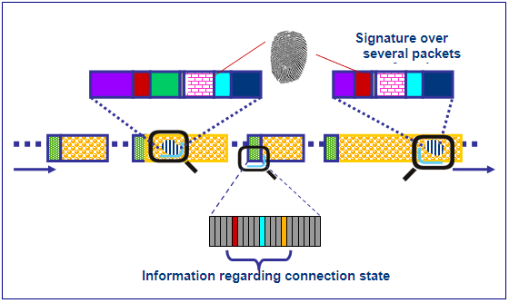

Deep packet inspection could be useful to ISPs who oversell  limited bandwidth to (too) many customers. With Deep Packet Inspection,  my ISP could inspect the contents and details of the high-bandwith traffic going to and from my  neighbor:

Our ISP could then determine most of it to be peer-2-peer traffic, and then limit  exactly that peer-2-peer traffic so that my neighbor ( :-) ) doesn't hog all  the bandwidth that we all have to share. On the surface, that sounds  like a great idea? Why should my neighbor ruin the internet experience  for the rest of us? There's a catch...

Interestingly, ISPs aren't going to tell customers exactly what  traffic will be limited / throttled, they'll just go ahead and do it.  Today peer-2-peer will be throttled. Tomorrow it'll be large HTTP  downloads and by the way, your ISP might decide that since they also  sell their own Voice over IP solution, they'll throttle Skype so it  isn't usable, and you'll have to buy _their_ Voice over IP solution. And so on. This is [Net Neutrality](http://www.savetheinternet.com/frequently-asked-questions) - we don't want ISPs selectively throttling certain traffic, because we  don't trust that they'll have our interests at heart when they do it.

If ISPs do want to do it, they can always do it based on what servers we communicate with. We can't stop them doing that.

They can also base it on what [TCP and UDP ports](http://en.wikipedia.org/wiki/TCP_and_UDP_port) we use. That is useful, but can be circumvented by using non-standard  ports. And some protocols don't even use standard ports. Deep Packet  Inspection would come into play if the ISP wanted to identify even  though it was using non-standard ports. They could look at the traffic  itself and determine what "it looks like" and base their throttling on  that.

And that would work today.

My prediction is, though, that if Deep Packet Inspection were to become common, inevitably people would circumvent _that_ e.g. with encryption. Deep Packet Inspection won't work on encrypted  traffic (because by definition, encrypted traffic can't be inspected).

So I come to a conclusion:

<blockquote>If Deep Packet Inspection becomes widespread, the  consequence will be that encryption becomes equally widespread, making  the internet a safer place for all of us!</blockquote>

Deep Packet Inspection leads to Encryption which would also make it  impossible for the government to snoop anybody's emails and have many  other benefits. Wonderful. So bring it on!

