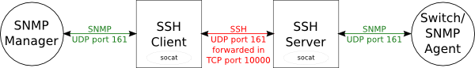

Here is an example of the problem we need to solve: We have SSH access to a network, but want to access an SNMP agent in that network from a local client. We use SNMP here in this example, but it could be any other protocol that uses UDP, such as DNS or TFTP.

We'll forward the SNMP traffic in a TCP port like this, with "socat" doing the UDP-in-TCP tunneling:

<!-- more -->

One could use netcat, and that works as long as the SNMP client uses the same source port. But it changes source port eventually, trust me! :-)

Instead, we use socat. It has a "fork" parameter, that does exactly what we want.

# Install socat

socat needs to be installed on both the SSH client and server. On ubuntu/debian this is done with:

    client$ sudo apt-get install socat
    client$ ssh server
    server$ sudo apt-get install socat

# Stop the SSH client's snmpd (if any)

Because we'll want the SNMP manager to be able to query the SSH client as if it was the switch, SSH client's snmpd (listening on UDP port 161), needs to be stopped. Again, on ubuntu/debian this is done with:

    client$ sudo /etc/init.d/snmpd stop

# Run socat on both SSH client and server

Now we're ready to run this. You'll need two terminals that start on the SSH client to sit around doing nothing (or use screen)

Terminal one:

    client$ ssh -L 10000:localhost:10000 server
    server$ socat -T10 TCP4-LISTEN:10000,fork UDP4:switch:161

This creates the SSH forwarding of TCP port 10000 and runs socat on the server. Notice how the switch's IP address is mentioned in the socat command line as "switch".

Terminal two:

    client$ sudo socat UDP4-LISTEN:161,fork TCP4:localhost:10000

That sets up socat on the client. That should do it.

# Test it!

    client$ snmpget -v2c -cpublic localhost sysName.0
    SNMPv2-MIB::sysName.0 = STRING: switch

Yup, it works!
