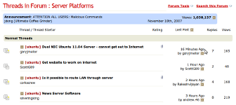

A Danish Minister approves an ad-agency to pose as real users and stuff a forum with bogus posts to _kick-start_ it. I'm appalled, surprised at my own ignorance and worried about the lack of credibility of even government-funded sites.<!-- more -->

Today there is an [article in Politiken](http://politiken.dk/indland/ECE1339009/minister-bag-kampagne-med-falske-indlaeg/) (a Danish newspaper) about the Danish Fødevareminister (== "Minister of Food"?) having hired an advertising agency to create a campaign for healthier fast food. The advertising agency created a website _and_ stuffed it with bogus postings posing as normal users. It was revealed that 20% of all postings on the site were from these same people. This was "_to kick-start the campaign_". Compounding the issue, in an evaluation of the campaign, these 20% bogus postings were included as real user feedback.

The Minister of Foods, Henrik Høegh (V), has allegedly been aware of this going on, but can't see any problem with it.

_Seriously_? I'm surprised this isn't illegal. Only time will tell if it will have any repercussions for him.

I am also confronted with my own high level of naivité: "_Hey, if users post to a forum, they are real live users not affiliated with the site, unless explicitly stated otherwise._" Of course I know ratings systems are stuffed, late-night TV interviews aren't real (!) and things like this take place - at least on dubious websites. But I'm pretty sure I'm not enough on the lookout for it when I view forums online. Are you?
