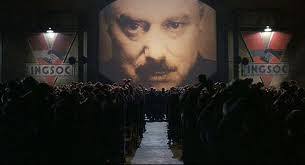

Here in Denmark, we've just had an election, and the previous government has been replaced.

A [newspaper article [lang="da"]](http://sondagsavisen.dk/2011/37/her-er-danskernes-dom-over-vk.aspx) looks back at what people liked and disliked about what the previous government did.

I have trouble believing, much less understanding, that 68% consider increased surveillance to have had a positive effect for Denmark, 16% believe the effect to be neutral and 16% believe it to be negative.

Wow. The people who believe that our society is better off when the government monitors us more out numbers people like me 4 to 1? Yikes. Has nobody read [1984](http://gutenberg.net.au/ebooks01/0100021.txt) or seen [Das Leben der Anderen](http://www.imdb.com/title/tt0405094/synopsis)? Doesn't anybody remember DDR or the Soviet Union? Perhaps China will open source the great firewall too, so we can install it here!

I'm a little sad today about this.

Edit on 2011-10-20. Oh no, it keeps getting [worse [lang="da"]](http://politiken.dk/indland/ECE1426363/vi-elsker-overvaagning---pet-jubler/).
