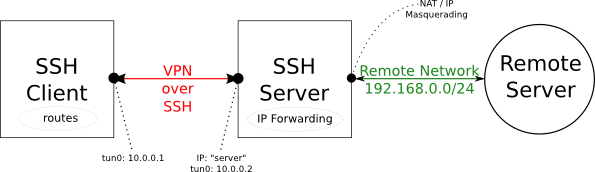

I've written [before](/2011/07/05/forwarding-snmp-ports-over-ssh-using-socat/) about how to access SNMP agents (or other TCP or UDP services) in a network when you only have SSH access. Running a SSH VPN and then running IP Masquerading (NAT) in the remote end is _the_ solution for me so far. Here is how it is done.

<!-- more -->

In the figure above, the Remote Server could be any TCP or UDP service in the remote network. My personal itch was to access SNMP agents in a remote network.

About 10.0.0.1 and 10.0.0.2: You'll need to choose a network that isn't being used in either side of the link. I've chosen the 10.0.0.0/24 network here but you can choose whatever makes sense to you. Just make sure it isn't already used on either side.

First, we'll set up the SSH VPN, and then we'll add the networking trimmings (NAT and routes) so we can access the entire remote network from the SSH client. Finally I'll also briefly cover PPP over SSH (a similar solution) which could be handy in some situations. Regardless, you'll need root access on both SSH client and SSH server machines. And of course you'll need SSH access to the SSH server! :-)

# SSH VPN

Following [a good resource](https://help.ubuntu.com/community/SSH_VPN), it is really rather simple.

First on the server, make sure that /etc/ssh/sshd_config contains the PermitTunnel yes setting, or you'll get an error like: channel 0: open failed in the following.

Now, from the SSH client:

    
    sudo SSH_AUTH_SOCK=$SSH_AUTH_SOCK ssh -w 0:0 root@server

That establishes the tun0 devices in both ends. Now we need to configure them. On the server:

    
    ip link set tun0 up
    ip addr add 10.0.0.2/32 peer 10.0.0.1 dev tun0

On the client:

    
    ip link set tun0 up
    ip addr add 10.0.0.1/32 peer 10.0.0.2 dev tun0

ifconfig on both client and server should show that you're up and running. Test it like this from the client:

    
    $ ping 10.0.0.2
    PING 10.0.0.2 (10.0.0.2) 56(84) bytes of data.
    64 bytes from 10.0.0.2: icmp_req=1 ttl=64 time=13.1 ms
    64 bytes from 10.0.0.2: icmp_req=2 ttl=64 time=13.7 ms
    .....

Now the SSH VPN is up and running. What this means is you'll be able to access any resource on the SSH server, but _not_ yet everything in the 192.168.0.0/24 network.

Please, for more details and hints about this (especially about the different approaches to root and SSH) see [the good resource](https://help.ubuntu.com/community/SSH_VPN).

# IP Masquerade (NAT) and routes

The goal is that we want to access any equipment in the remote 192.168.0.0/24 network without having to make any changes in the remote network. That is done with [IP Masquerading](http://tldp.org/HOWTO/IP-Masquerade-HOWTO/ipmasq-background2.1.html) on the server side and appropriate routes on the client side (see diagram above).

To set up, do this on the server side (assuming the remote network is accessed with eth0):

    
    echo "1" > /proc/sys/net/ipv4/ip_forward
    iptables -t nat -A POSTROUTING -o eth0 -j MASQUERADE

Now, on the client side:

    
    route add -net 192.168.0.0/24 tun0

That should be it! You can access all of the remote 192.168.0.0/24 network from the SSH client as if you were locally connected. Repeat this route command for all routes in the remote network you need access to.

## DNS

If the remote network has its own DNS server, add its IP address to /etc/resolv.conf and you'll be able to access them by name too.

# SSH VPN alternative: PPP link over SSH

If for some reason the SSH VPN doesn't work for you (e.g. old SSH version or you can't enable the PermitTunnel yes setting), then you might want to use PPP over SSH instead. This requires the ppp package.

sudo /usr/sbin/pppd noauth 10.0.0.1:10.0.0.2 pty \
"SSH_AUTH_SOCK=$SSH_AUTH_SOCK ssh -t -e none root@server /usr/sbin/pppd passive noauth"

The tricky part here is that you can't enter a sudo password on the remote side. ( I don't think so anyway ). So you'll need to be able to either log in directly as root (which is fine if you're using [SSH keys](https://help.ubuntu.com/community/SSH/OpenSSH/Keys)), or have[ sudo set up to not require a password for pppd](http://www.faqs.org/docs/Linux-mini/ppp-ssh.html#AEN271). I chose the former.

Now you'll have a ppp0 interface on both sides already configured with IP addresses and everything. Just continue to the "IP Masquerade (NAT) and routes" part (use ppp0 instead of tun0 though)

# More information

Keep in mind, that if all you have is SSH (which runs over TCP), performance is going to be problematic. See [Why TCP Over TCP Is A Bad Idea](http://sites.inka.de/bigred/devel/tcp-tcp.html). That is part and parcel with the SSH-only access and therefore unavoidable regardless of solution.

I found all my information in man pages and here:

* [SSH_VPN - Community Ubuntu Documentation](https://help.ubuntu.com/community/SSH_VPN)
* [NAT with Linux and iptables - Tutorial (Introduction)](http://www.nardol.org/2009/1/12/quick-and-dirty-vpn-with-pppd-and-ssh)
* [Nardol: Quick and Dirty VPN with pppd and ssh](http://www.nardol.org/2009/1/12/quick-and-dirty-vpn-with-pppd-and-ssh)

Last, I wish [sshuttle](https://github.com/apenwarr/sshuttle) would do the trick, but for UDP it doesn't quite do the job [yet](http://groups.google.com/group/sshuttle/browse_thread/thread/9a5ad7c8561f5641#) and requires a newer kernel.
