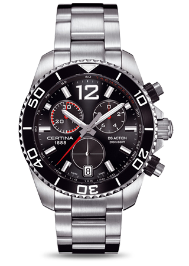
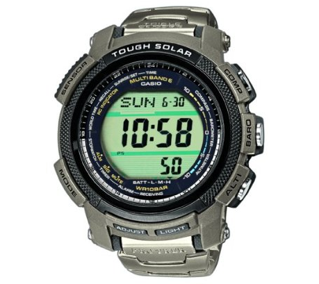
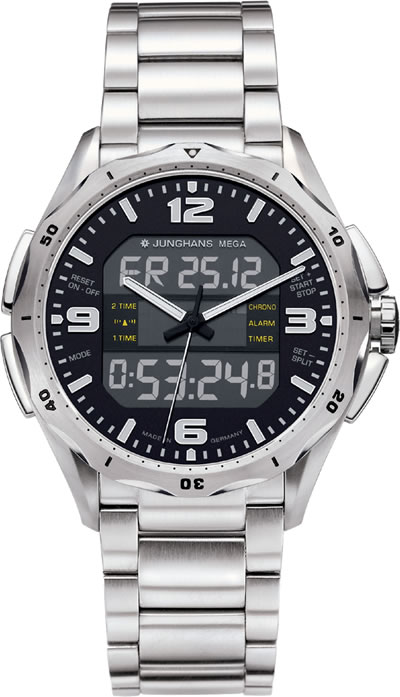
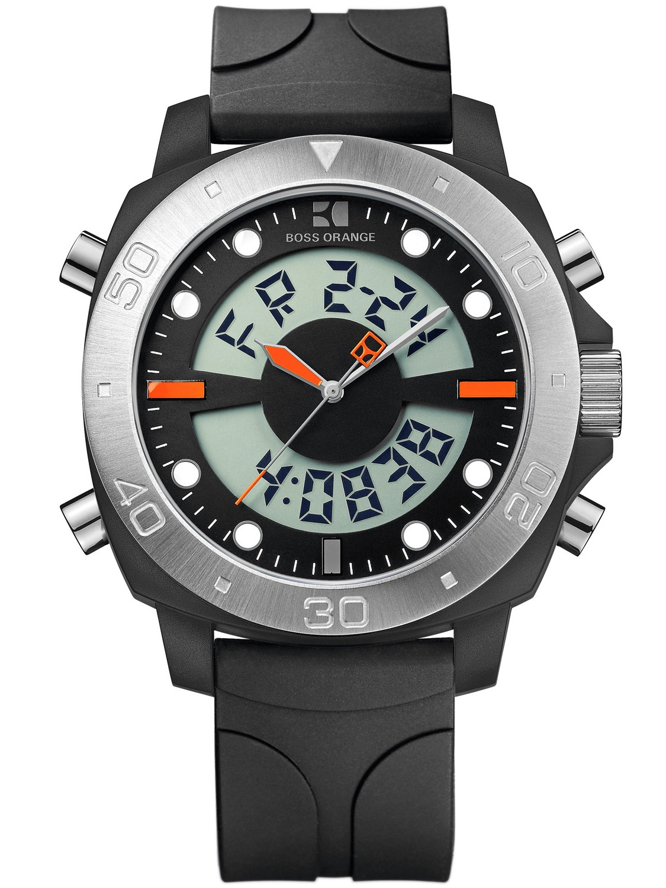
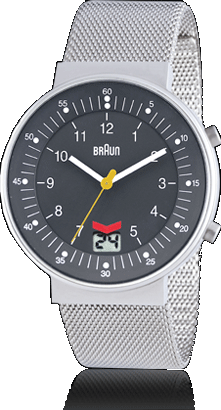

I love watches.

Being a techie, I really can't accept a watch that isn't accurate. The accuracy of a quartz-crystal based watch is the minimum. I wish I could get a Rolex, Omega or other really nice looking watch, but I just can't accept the accuracy I'll get from a watch like that. So all the beautiful Swiss watches are out for me. But there are alternatives:

<!-- more -->

I have a [Certina DS-Action ](http://www.certina.com/Collection/Gent-Quartz-Collection/DS-Action.aspx?m=1) quartz watch (shown right) and a [Casio PRW 2000T](https://www.google.com/search?hl=en&safe=off&client=ubuntu&hs=FsW&channel=fs&q=prw+2000t&bav=on.2,or.r_gc.r_pw.r_cp.r_qf.,cf.osb&biw=1421&bih=867&um=1&ie=UTF-8&tbm=isch&source=og&sa=N&tab=wi&ei=KbaZT7PzG8n64QTouunEBg)

and I love them both for different reasons. The Certina DS-Action is just so beautiful. The Casio PRW 2000T is feature-packed.

I _love_ how the Casio is Radio Controlled. That gives me sub-second accuracy! As much accuracy as my eyes can follow. Fantastic! Is this server's NTP working? Look at my wrist. I can trust _that_. I'm afraid I can't go back. That is why I'm wearing the Casio almost all the time now. But it isn't as nice looking.

Basically there are three makers of Radio Controlled watches. Junghans, Casio and Citizen. I haven't yet found a radio controlled watch that I like the looks of. The closest was [Junghans Aviator](http://www.junghansradiocontrolledwatches.co.uk/product/72/?PHPSESSID=6c721bcc17bf6045d3f398c26472ef45). It looks really nice on picture, but when my friendly watch shop ordered it so I could see it, it just wasn't as nice. It is really thick:

It has what I'm looking for: A analog+digital watch that is good looking and radio controlled. Only it isn't that good looking :-(

Other nice watches I like:

[BOSS Orange](http://www.bosswatches.co.uk/p-314-boss-orange-watch-1512678.aspx) it is nice looking, but not radio controlled.

[Braun BN0087](http://www.braun-clocks.com/watch/BN0087) It looks sorta nice, but is a bit old-school.

Then there is [Maximilian 5402M-3](http://www.amazon.com/Maximilian-Controlled-Digital-Chronograph-5402M-3/dp/B0046K6G7G/ref=sr_1_6?s=watches&ie=UTF8&qid=1335476595&sr=1-6) and [Gardé](http://de3.netpure.de/cgi-bin/baseportal.pl?htx=/ruhla/uhr02_detail&katalognr==200003) both of which are almost nice...

I bet there'll be more... Here is a nice [list of radio controlled watches](http://www.atomic-clock.org.uk/watches/radio-controlled-watches.php) and [manufacturers](http://forums.watchuseek.com/f2/only-casio-citizen-makes-radio-controlled-watches-596958.html#post4366144). Gadgets... I spend more time than I care to admit looking for gadgets. I spend a lot of time surfing for watches. Its a mess! :-)
