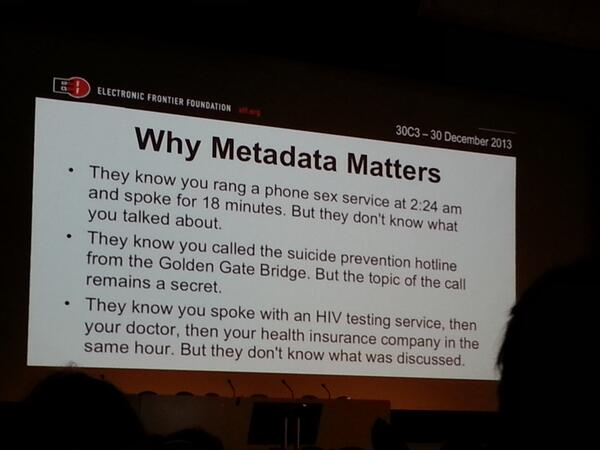

Many people I've spoken to seem to think that they don't have anything to hide, and as long as the government isn't listening in on the actual phone conversations, then they're fine with it. As you might guess, I'm not. This [slide](https://twitter.com/pinkflawd/status/417649515131596801/photo/1) from 30th Chaos Communication Congress (30C3) hits the head on the nail.
