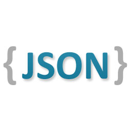
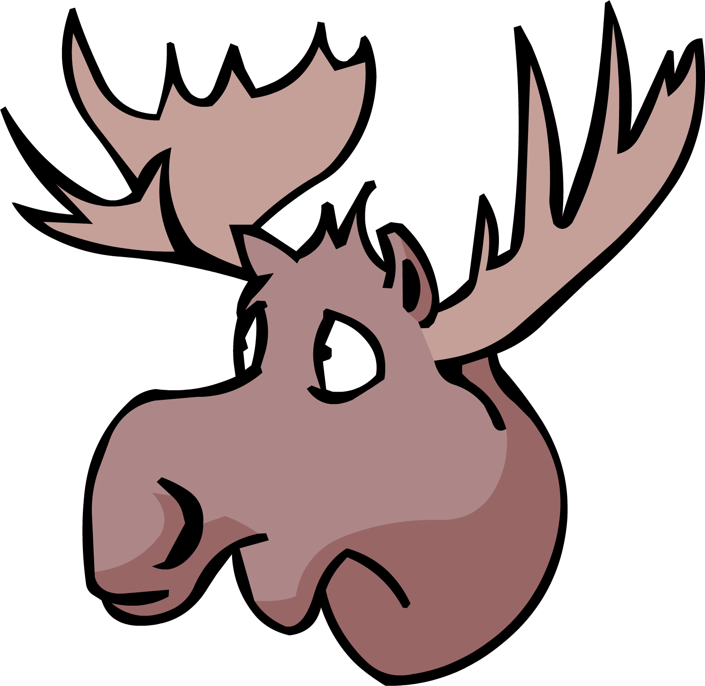

 

Two things have occurred lately for me in Perl:

1. I've been bitten enough times by un(der)specified RPC and API documentation to make it worth my while to begin documenting the interfaces in schemas.
2. I've been bitten by [Moose](http://moose.iinteractive.com/en/about.html). Using real objects instead of raw hashes.

<!-- more -->It seems to me that the schema language of choice these days is [JSON schema](http://json-schema.org/). In both of Perl's implementations, JSON::Schema and JSV, they actually validate perl data structures, not JSON. Perfect!

So now all I need to do is find a library that generates Moose classes from JSON schema. ( [Nothing on Google](https://www.google.com/search?q=moose+json+schema) :-( ) . Wouldn't it be great to have:

    use MooseX::FromJSONSchema;
    my $class = MooseX::FromJSONSchema($schema, "My::API::SomeSchema");
    # Or My::API::SomeSchema->new(...)
    my $instance = $class->new( field1 => "hello world", field2 => 23);
    $instance->field1("New value");
    printf "field2: %d\n", $instance->field2();

I'm wondering why this isn't a huge thing? Then I could use this autogenerated code for both sides of the API as is already possible in other languages.

I'm wondering why this hasn't been implemented yet.

What are other people doing? Couldn't be too difficult to whip up in Perl I think.  I guess [80%](http://en.wikipedia.org/wiki/Pareto_principle) of the functionality could be super-useful and come at 20% of the full implementation cost.
