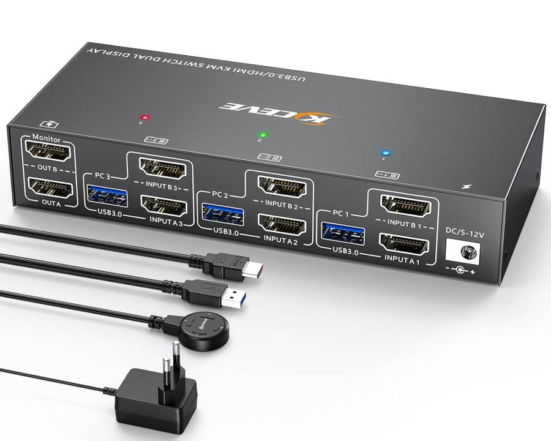
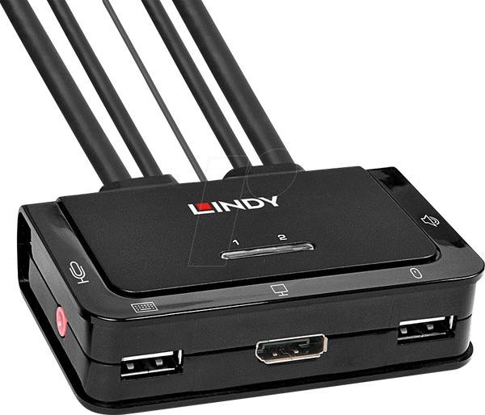

## TL;DR

Lesson learned. I need EDID emulation in a KVM if I want to be able to connect to my desktop remotely with e.g. [x11vnc](https://github.com/LibVNC/x11vnc) or [rustdesk](https://rustdesk.com/) or anything really.

One without EDID works fine unless I need to to connect to it remotely. And I do! 🙂.

So now I'm using a KC-KVM302AS: A 3-Port 2-Monitor HDMI 4K60Hz KVM-Switch with EDID Emulation:

## Details

A KVM allows me to switch my mouse, keyboard, webcam and monitor between my work laptop and my private desktop.

### The problem with a non-EDID emulating KVM

I had another KVM before this one, without EDID emulation, a Lindy KVM 42340:

The problem with this one was, that if I moved the KVM to the "laptop" position, it moved the monitor to the laptop, and so the desktop was no longer attached to a monitor. This meant that the graphics card no longer had a monitor attached. And so when I attached to the desktop with e.g. `rustdesk`, I got a "Prompt / No Displays" error message.

An EDID emulator pretends to be a "live" monitor regardless of whether the monitor is actually attached or not.

I first tried adding a [HDMI EDID Emulator (LogiLink)](https://elektronik-lavpris.dk/p143277/hd0105-logilink-hdmi-edid-emulator/) between the KVM and the graphics card. That sort of worked: Rustdesk now could connect regardless of the position of the KVM.

But using the actual desktop normally without rustdesk didn't work properly. When I e.g. logged in from gdm, I could see a black screen, and I had to disconnect the EDID emulator and then reconnect it, to see my logged-in desktop. Or I could toggle KVM to the laptop and then back to the desktop, but that only worked if the laptop was also attached to the KVM. It was a mess.

### What the EDID-emulator does

It makes it appear to both the laptop and the desktop that the monitor is always attached.

First of all, that means that the attached devices don't resize all the windows every time you switch to them, but also, that remote access tools like [x11vnc](https://github.com/LibVNC/x11vnc) or [rustdesk](https://rustdesk.com/) or whatever suddenly work properly.

I ain't never going back.

## Thanks to user `HJ_wu` on reddit

I posted my problem on reddit: [Rustdesk client using Linux, xorg and a KVM switch : r/rustdesk](https://www.reddit.com/r/rustdesk/comments/1jeidxg/rustdesk_client_using_linux_xorg_and_a_kvm_switch/) and it was [HJ-wu's answer](https://www.reddit.com/r/rustdesk/comments/1jeidxg/comment/miklkfh/?utm_source=share&utm_medium=web3x&utm_name=web3xcss&utm_term=1&utm_content=share_button):

> Pick KVM switch that has "true EDID" builti-in.

This answer pointed me in this direction.