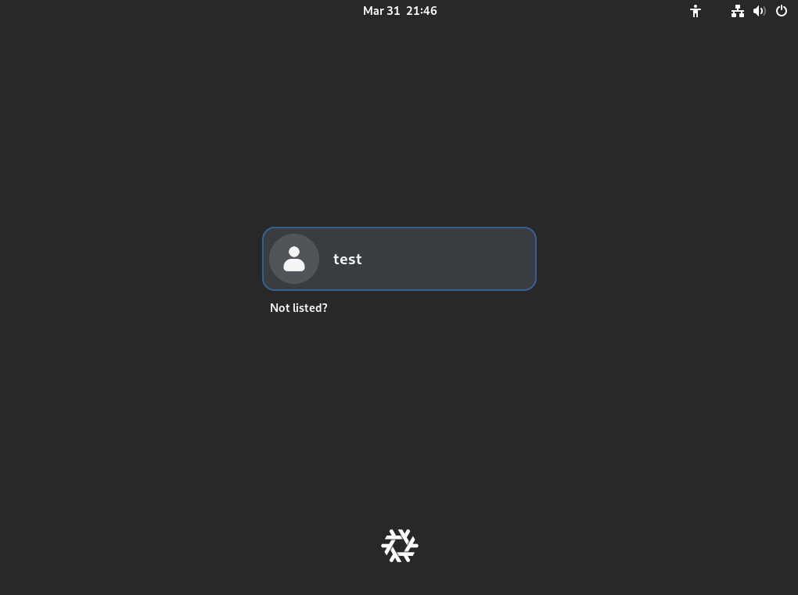
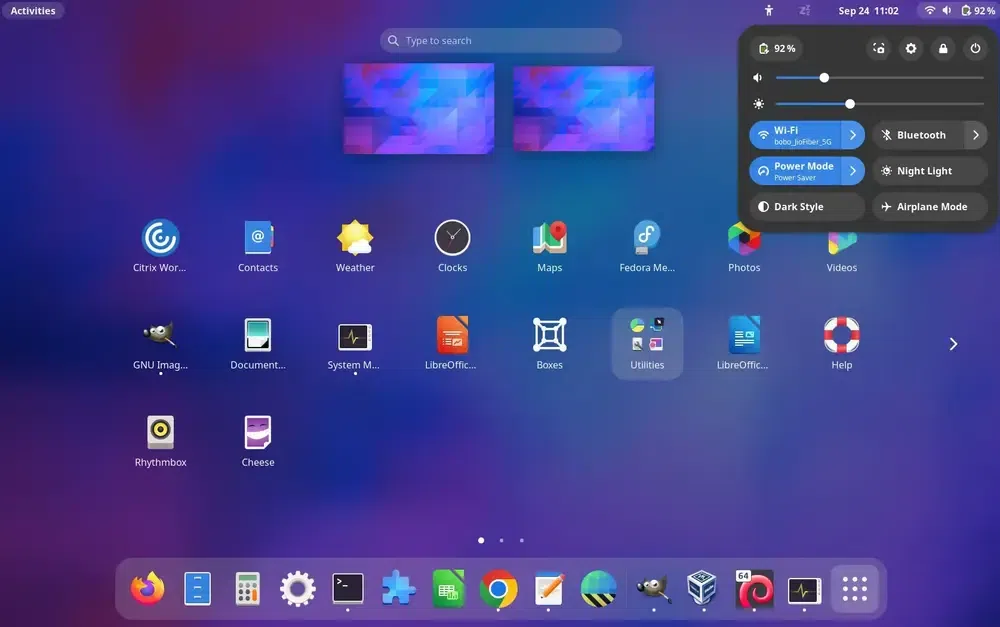
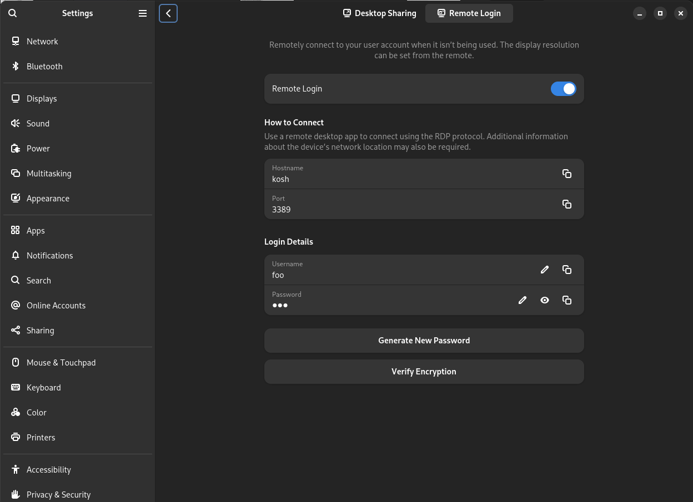

Edited on 2026-01-26 after upgrading to NixOS 25.11 and GNOME 49, which don't
support X11. Wayland is the only option from now on.

## TL;DR

Here I compare Gnome Remote Desktop, RustDesk and `x11vnc`.

I ended up using Gnome Remote Desktop for "Desktop Saring", but not for "Remote
Login" because it doesn't work without Network Manager, and I don't use Network
Manager. Also, it doesn't allow logging into the physical desktop (see below).

For "Remote Login", I'm using `ydotool` to send `<Enter>` and my password to login with GDM. Hacky, but it works.

### Wayland disqualifies `x11vnc` and RustDesk

The name almost implies it, but `x11vnc` that I've used for years now no longer
works.

While RustDesk seems to work fine, it requires a custom client and a self-hosted
server (or using somebody else's server) and I'm not sure I trust it; a gut
feeling, that could be wrong. Also, under Wayland it doesn't allow me to log in with GDM. So it doesn't really buy me anything over Gnome Remote Desktop.

## Background

I have a desktop machine at home, and I want to be able to access it remotely.

I already have [wireguard](https://www.wireguard.com/) set up to access my home
network, so I don't need to traverse firewalls or have my desktop accessible
from the internet. In fact I'd prefer not to.

And what i want to access is the "real" desktop that I see on my monitor at
home. See that window I know I left open, close that app "nicely" that I know I
left running. Not a virtual desktop.

This is about the options I have for accessing a Gnome desktop remotely and
which I've picked.

In the following, I'll distinguish between "pysical" login screens and desktops
(those you can also see on a monitor connected to the physical machine) and
"virtual"  login screens and desktops that are not shown directly anywhere.

## Security considerations

The problem with accessing the "real" desktop is that this desktop will be
unlocked and available to anyone in the vicinity of the machine whose desktop
I'm accessing. And if I'm not there, the mere fact of "unlocking" the desktop
might give unauthorized parties access to an otherwise locked desktop.

This is something I can live with, though, since only my wife and daughter have
physical access to that desktop machine, and I trust them. It is something to
consider, though.

### Stored passwords

Most of the solutions store passwords for remote access in clear text, which
kinda sucks. See below.

## My environment

I'm using Gnome under NixOS. I've tried everything here with Gnome under Ubuntu
24.04 too.

## The two steps of "desktop access"

It is not enough to be able to access a physical desktop that has already been
started, I also need to be able to start the desktop. And unless the system has
been setup to auto-login, when sitting in front of the monitor, when using
Gnome, first the user sees the GDM login screen:



and after logging in, they see the desktop:



So we need to be able to login from a remote location and view the desktop
afterwards.

## The contenders

These are the solutions I've considered:

* Gnome Remote Desktop: offering RDP access to a gnome desktop
* RustDesk: The new kid on the block
* x11vnc: The old trusted X11-only solution

I've kicked the tires on all of them, and spoiler alert: I'll be using
Gnome Remote Desktop.

### Gnome Remote Desktop: offering RDP access to a gnome desktop

Gnome remote desktop is really two solutions:

1. "Desktop Sharing": Access the desktop of somebody who has already logged in
   to the desktop on the physical machine.
1. "Remote Login": Logging in as a user who is not logged in to the desktop on
   the physical machine.

"Desktop Sharing" gives RDP access to a running physical desktop. Access is
prevented by default if the desktop is locked because of inactivity. This is a
security measure to avoid unlocking the physical desktop for all to see and
access. I understand this limitation, but it would have made Gnome Remote
Desktop's "Desktop Sharing" useless to me, if it wasn't for the [Allow Locked
Remote
Desktop](https://extensions.gnome.org/extension/4338/allow-locked-remote-desktop/)
GNOME Shell Extension that exactly lifts this limitation. And then it works
brilliantly.

"Remote Login" works a little differently than I first thought. It runs on
another TCP port than "Desktop Sharing". When you connect with RDP, you see a
virtual GDM login screen, and if you try to login as a user that is already
logged in on the real desktop, you'll get an error. Otherwise, it will start a
*virtual* desktop in that user's name. So it doesn't allow you to start the
"physical" desktop.

Together, one can use "Desktop Sharing" if the physical desktop has already been
started, and "Remote Login" if it hasn't. The only problem is that if you forget
to logout from the virtual desktop, you will not be able to login to the
physical desktop while the virtual desktop is running. I could live with that.

However, there seems to be a
[problem](https://discourse.gnome.org/t/can-i-run-gnome-remote-desktop-without-networkmanager/28116)
getting "Remote Login" to work without Network Manager. And I don't use Network
Manager, but have configured the network statically in NixOS, so for now, I need
to either use Network Manager or not use "Remote Login".

Gnome Remote Desktop is configured in Gnome Settings -> System -> Remote
Desktop in two tabs:



#### How are Gnome Remote Desktop passwords stored?

For "Desktop Sharing", they're stored in Gnome's "Passwords and Keys" (Seahorse)


Where "Copy" then copies `{'username': <'test'>, 'password': <'bar'>}`.

For "Remote Login":

```
sudo cat /var/lib/gnome-remote-desktop/.local/share/gnome-remote-desktop/credentials.ini
[RDP]
credentials={'username': <'foo'>, 'password': <'bar'>}
```

So in both cases stored as clear text. ☹️

#### Logging in to GDM with `ydotool`

[ReimuNotMoe/ydotool](https://github.com/ReimuNotMoe/ydotool) allows us to send
keystrokes also to GDM, also under Wayland. So I've written a `gdm-login` script
that checks that no desktop has been started yet, and that GDM is started. It
then asks me for my password and sends first `<Enter>` and then after a pause
sends my password. It then lets the user know if a desktop was started. If the
desktop didn't get started, the password was likely wrong, try again.

### RustDesk: The new kid on the block

Rustdesk seems to handle both the physical GDM login under X11 and accessing the physical desktop just fine. But not the physical GDM login under Wayland. So I've stopped using RustDesk myself.

But I had difficulties getting RustDesk to work as a service in NixOS, and I
finally
[managed](https://www.reddit.com/r/rustdesk/comments/1jhn2pa/comment/mjbjrcv/),
so I'll leaving this information here. I was self-hosting the [server
part](https://rustdesk.com/docs/en/self-host/rustdesk-server-oss/docker/) so was
fully self-hosted also for rustdesk.

I could not find any clear info about where/how rustdesk stores passwords, so
I'm assuming it is in clear text somewhere (please let me know if I'm wrong).

A very prolific NixOS poster
[remarked](https://discourse.nixos.org/t/how-to-best-enable-sudo-en-a-systemd-services-rustdesk/62065/2)
about the way rustdesk uses `sudo`:

> Whoa, that’s quite some horrible application code. This should be done with
> polkit. I’d seen this project around, really expected slightly better quality
> from it…

RustDesk used to only support X11, but now has experimental Wayland support
since version 1.2.0.

### `x11vnc`: The old trusted solution

This only works for X11, and not for wayland. (Which is perhaps why Gnome Remote
Desktop was created?) With it, I could both remote control GDM and the desktop.

## Summary

See TL;DR at the top 🙂